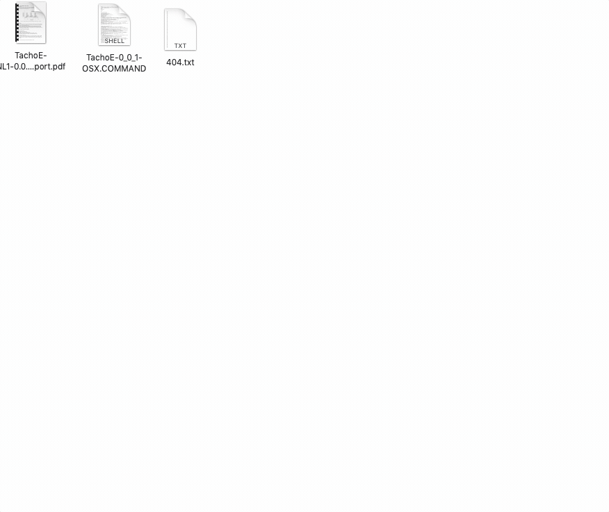

#  TachoE-NL1-0.0.1

TachoE is a tool to study heart rate variability by providing time, frequency and non linear parameters, starting from tachograms.

## Installation

*OSX: download TachoE-0.0.1-OSX and double click on the downloaded file to start the program.

*Windows: download TachoE-0.0.1-WS and double click on the downloaded file to start the program.

## Sample Dataset
Irurzun, I. M., Garavaglia, L., Defeo, M. M., & Thomas Mailland, J. (2021).  RR interval time series from healthy subjects  (version1.0.0).  PhysioNet. https://doi.org/10.13026/51yd-d219", also available in tachograms folder.

## Usage
*Analyze Data:

- click on "Analyze a tachogram"

- click on "Browse" to select a tachogram file. Only .txt file with positive integers are supported. 

- click on "ok" to and wait a few second to see the results

*Export Data:

- click on "Export Results"

- click on "Browse" to select the destination folder.

- click on "ok" to generate a pdf file with the results

## Demo

## Report

Preliminary studies on reference papers, goal of the analysis, metrics and dataset, projects and software specification, implementation choices, and further developments are available in "TachoE-NL1-0.0.1_Report.pdf"

